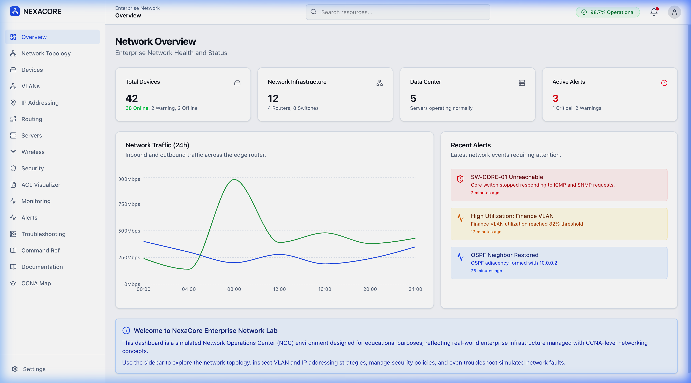
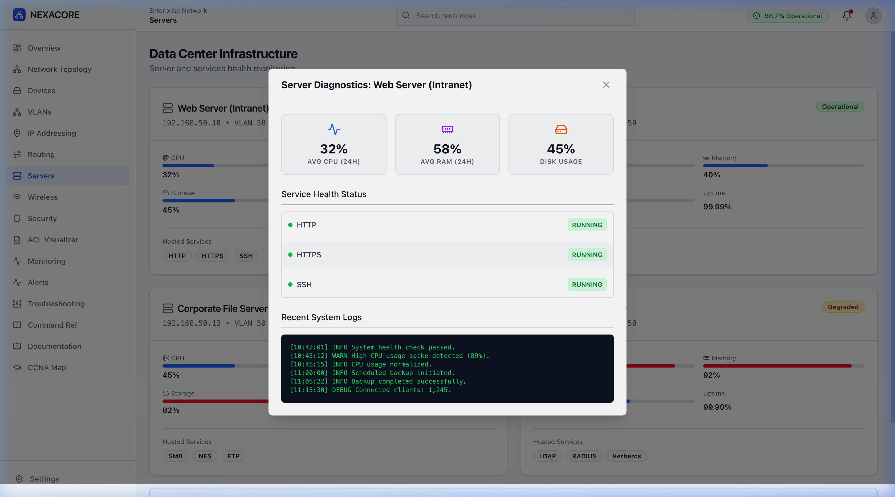
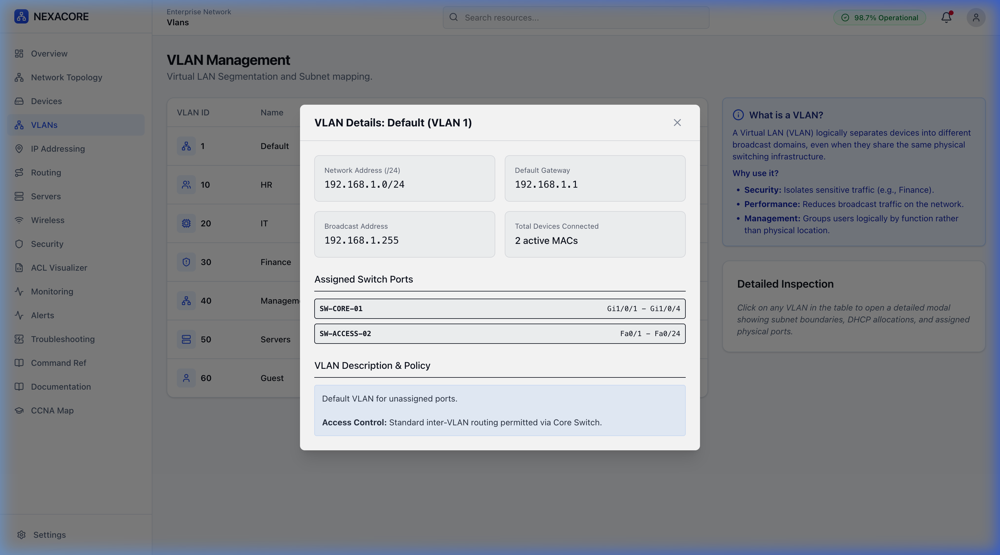
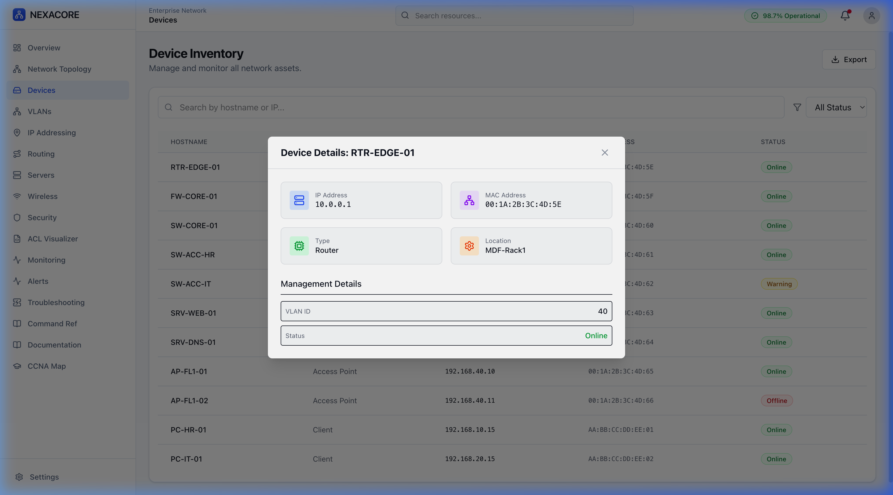
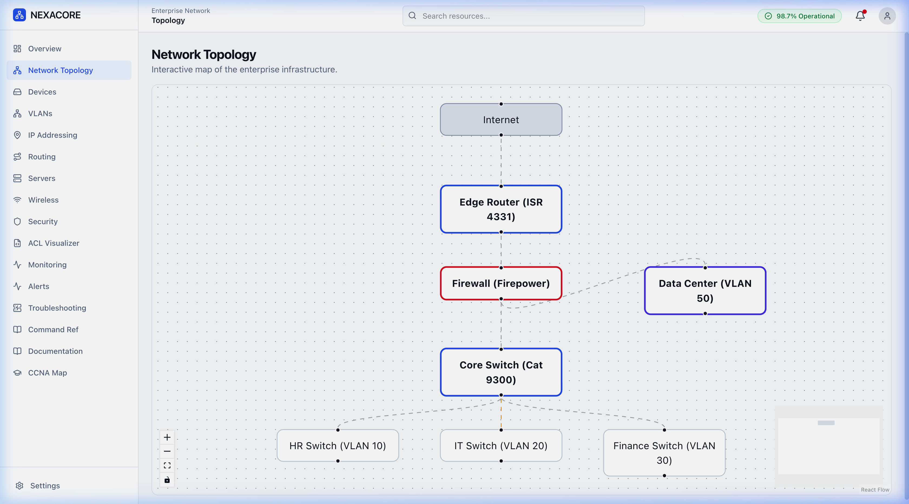

<div align="center">
  
# 🌐 NexaCore Enterprise Network Dashboard

**A professional, highly interactive Network Operations Center (NOC) & Data Center Management application built alongside a Cisco CCNA certification.**

[](https://reactjs.org/)
[](https://www.typescriptlang.org/)
[](https://vitejs.dev/)
[](https://tailwindcss.com/)
[](https://www.cisco.com/c/en/us/training-events/training-certifications/certifications/associate/ccna.html)

</div>

---

## 📖 Overview

NexaCore is a simulated **Enterprise Infrastructure Dashboard** designed for Network Engineers and IT Administrators. It provides a highly detailed, interactive visual interface for managing complex network topologies, VLAN segmentations, IP addressing, and server diagnostics.

This project was developed to bridge the gap between theoretical **CCNA 200-301** concepts and practical, modern software visualization.



---

## ✨ Key Features

- **📡 Interactive Network Topology**: A fully draggable, visually mapped representation of Core, Distribution, and Access layers (powered by `@xyflow/react`).
- **🔍 Deep Device Diagnostics**: Click on any Router, Switch, or Firewall to view real-time (simulated) interface states (UP/DOWN), MAC addresses, and OS versions.
- **🖥️ Data Center Management**: Monitor server health with interactive modals displaying CPU, Memory, Storage usage, running services, and live system logs.
- **🛡️ VLAN & Subnetting Visuzalizer**: Manage Layer 2 segmentation with detailed views of Network Addresses, Default Gateways, and exact assigned physical switch ports.
- **🚨 Incident & Alert Management**: An interactive alarms table that provides full incident reports and actionable remediation playbooks for NOC operators.
- **📚 Integrated CCNA Command Reference**: A built-in cheat sheet for Cisco IOS commands (Routing, Switching, Security).

---

## 🖼️ Gallery & Interactivity

The dashboard is designed so that **everything is clickable and deeply detailed**.

| Server Diagnostics | VLAN Inspections |
| :---: | :---: |
|  |  |

| Device Details | Network Topology |
| :---: | :---: |
|  |  |

---

## 🛠️ Technology Stack

- **Frontend Framework**: React 18
- **Build Tool**: Vite (Lightning fast HMR)
- **Language**: Strict TypeScript (`verbatimModuleSyntax` enabled)
- **Styling**: Tailwind CSS v4 (Custom Enterprise Light Theme)
- **Routing**: React Router DOM v6
- **Diagrams/Topology**: React Flow (`@xyflow/react`)
- **Icons**: Lucide React
- **Charts**: Recharts

---

## 🚀 Getting Started

### Prerequisites
Make sure you have [Node.js](https://nodejs.org/) installed on your machine.

### Installation

1. **Clone the repository**
   ```bash
   git clone https://github.com/Shahreyaarr/NexaCore-Enterprise-Network-Dashboard.git
   cd NexaCore-Enterprise-Network-Dashboard
   ```

2. **Install dependencies**
   ```bash
   npm install
   ```

3. **Start the development server**
   ```bash
   npm run dev
   ```

4. **Open in Browser**
   Navigate to `http://localhost:5173` to view the dashboard.

---

## 🏗️ Project Structure

```text
src/
├── components/
│   └── ui/              # Reusable components (Modals, Cards, Buttons, Tables)
├── data/
│   └── networkData.ts   # Core simulation state & mock NOC data
├── pages/
│   ├── Overview.tsx     # Main NOC Dashboard
│   ├── DeviceInventory.tsx # Detailed asset tracking
│   ├── Topology.tsx     # Interactive React Flow diagram
│   ├── VlanManagement.tsx
│   ├── DataCenter.tsx   # Server health monitoring
│   └── ...
├── types/
│   └── network.ts       # Strict TypeScript interfaces
└── App.tsx              # React Router configuration
```

---

## 🎓 Educational Value (CCNA)

This project visually demonstrates the following Cisco CCNA concepts:
- **Network Fundamentals**: Topologies, OSI/TCP models, IPv4 subnetting.
- **Network Access**: VLANs, Trunks, Layer 2 discovery.
- **IP Connectivity**: Routing tables, OSPF basics.
- **Security Fundamentals**: ACLs, Port Security, Device hardening.
- **Network Management**: Syslog, NTP, SNMP concepts.

---

<div align="center">
  <i>Developed for professional enterprise infrastructure visualization.</i>
</div>
